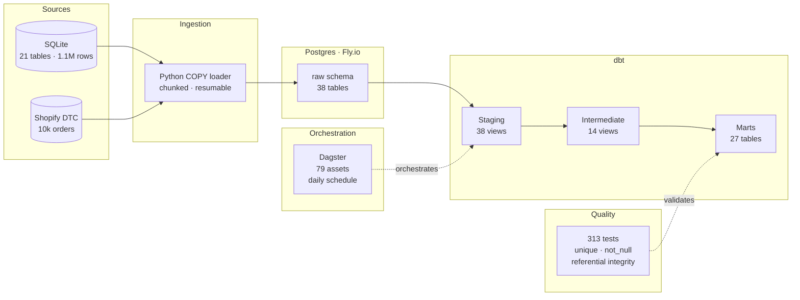

# Cinderhaven Data Platform

[](https://github.com/MsShawnP/cinderhaven-data-platform/actions/workflows/ci.yml)
[](https://msshawnp.github.io/cinderhaven-data-platform/)

Cinderhaven Provisions is a synthetic $25M specialty food brand. I built it so the analytical methodology behind every Lailara LLC engagement can be shown in full — real data shapes, real volume, real retailer complexity — without using client data. This repo is the complete source-to-mart data platform: Python seed scripts generate three years of transactional data into Postgres, dbt transforms it through staging, intermediate, and mart layers, and seven published projects consume the marts to demonstrate trade spend forensics, deduction recovery, OTIF diagnostics, channel profitability, and more.

## Canonical brand profile

| Dimension | Value |
|-----------|-------|
| Brand | Cinderhaven Provisions (synthetic) |
| Annual manufacturer revenue | ~$25M |
| Trailing-52w scan revenue | $32.5M |
| SKUs | 50 (5 lines × 10 each) |
| Product lines | Artisan Sauces, Pantry Staples, Specialty Condiments, Dried Goods, Snack Bites |
| Contracted retailers | 6 — Walmart, Costco, Whole Foods, Sprouts, Kroger, Regional Group |
| Distributors | 3 — UNFI, KeHE, DPI Northwest |
| DTC | Shopify |
| Data window | 36 months (see seed config for date range) |

## Downstream projects

Seven published projects consume this platform:

| Project | What it does | Live |
|---------|-------------|------|
| [product-data-health-audit](https://github.com/MsShawnP/product-data-health-audit) | Data readiness audit — traces $461K/yr in chargebacks to specific product data defects | [audit.lailarallc.com](https://audit.lailarallc.com) |
| [retailer-deduction-recovery](https://github.com/MsShawnP/retailer-deduction-recovery) | Deduction recovery — $1.65M backlog, five compounding operational failures, recovery simulation | [deductions.lailarallc.com](https://deductions.lailarallc.com) |
| [short-ship-cost](https://github.com/MsShawnP/short-ship-cost) | Short-ship cost — $33.1M across eight cost dimensions on $53M shipped | [shortships.lailarallc.com](https://shortships.lailarallc.com) |
| [trade-spend-leakage](https://github.com/MsShawnP/trade-spend-leakage) | Trade spend forensics — double-funded promotions, phantom promos, rate discrepancies | [trade-spend.lailarallc.com](https://trade-spend.lailarallc.com) |
| [otif-blind-spot](https://github.com/MsShawnP/otif-blind-spot) | OTIF diagnostic — 95% internal vs 86% retailer-scored, $430K/yr exposure | [otif.lailarallc.com](https://otif.lailarallc.com) |
| [contract-to-cash](https://github.com/MsShawnP/contract-to-cash) | Revenue lifecycle — traces every invoiced dollar to cash receipt (87¢ per dollar) | [cash.lailarallc.com](https://cash.lailarallc.com) |
| [where-the-money-comes-from](https://github.com/MsShawnP/where-the-money-comes-from) | Channel profitability — $91K more per $1M deployed to distribution vs retail | [capital.lailarallc.com](https://capital.lailarallc.com) |

Each project reads from the Postgres warehouse or from SQLite exports of the mart tables. The data platform is the single source — no project generates its own sample data.

## Canonical integrity

Every downstream project and every page on lailarallc.com cites figures from this platform. `CINDERHAVEN_CANONICAL.md` is the single source of truth — it locks the headline numbers (revenue, trade rates, chargeback counts, OTIF gaps) so no project re-derives them from raw data and risks drift.

The companion script `check_canonical.py` validates the live Postgres database against those locked values on every regen. It queries the warehouse, computes the same aggregates the downstream projects cite, and fails if any figure drifts beyond tolerance (2% for dollar amounts, 0.5 percentage points for rates). If the seed changes, the validator catches it before anything ships.

## Architecture



## What's in the warehouse

| Layer | Count | Materialization | Purpose |
|-------|-------|-----------------|---------|
| Raw | 38 tables | table | Faithful copy of source data |
| Staging | 38 models | view | Type casting, cleaning, null handling |
| Intermediate | 14 models | view | Crosswalks, entity resolution, economics |
| Marts | 27 models | table | Dimensions, facts, and analysis marts |

**Dimensions (7):** `dim_products`, `dim_retailers`, `dim_distributors`,
`dim_stores`, `dim_dtc_channels`, `dim_retailer_requirements`,
`dim_category_benchmarks`

**Facts (16):** Retailer channel (`fct_retailer_orders`, `_shipments`,
`_deductions`, `_payments`), distributor channel (`fct_distributor_orders`,
`_shipments`, `_deductions`, `_payments`), DTC channel (`fct_dtc_orders`,
`_transactions`, `_refunds`, `_chargebacks`), cross-channel
(`fct_chargebacks`, `fct_distribution`, `fct_promotions`, `fct_scan_data`)

**Analysis marts (4):** `mart_retailer_reconciliation`,
`mart_distributor_reconciliation`, `mart_dtc_reconciliation`,
`mart_channel_contribution`

## Data quality

313 dbt tests validate the pipeline:

- **Unique keys** on every primary key
- **Not-null** on required business columns
- **Accepted values** on enumerated fields
- **Referential integrity** between facts and dimensions

## Repo structure

```
cinderhaven-data-platform/
  cinderhaven/              # dbt project
    models/
      staging/              # 38 staging views + schema.yml
      intermediate/         # 14 crosswalk/resolution views
      marts/                # 7 dims + 16 facts + 4 analysis marts
    dbt_project.yml
  orchestration/            # Dagster project
    cinderhaven_orchestration/
      assets.py             # dbt → Dagster asset integration
      definitions.py        # jobs, schedules, resources
      project.py            # path configuration
    pyproject.toml
  scripts/
    ingest_sqlite_to_postgres.py   # COPY-based bulk loader
    generate_shopify_orders.py     # DTC data generation
  sql/
    raw_schema.sql          # 38 CREATE TABLE statements
  docs/
    architecture.md         # Architecture diagram + pipeline flow
    walkthrough.md          # Design decisions walkthrough
    data-gap-assessment.md  # Source data audit
    dbt-docs/               # Generated dbt docs site
```

## Stack

| Component | Tool | Version |
|-----------|------|---------|
| Warehouse | Postgres on Fly.io | 16 |
| Transformation | dbt-core + dbt-postgres | 1.11 |
| Orchestration | Dagster + dagster-dbt | 1.13 |
| Ingestion | Python (psycopg2 COPY) | 3.13 |

## Running locally

```bash
docker compose up -d          # starts Postgres 16 on localhost:5432
```

The `scripts/init-db.sh` entrypoint restores the Cinderhaven database from a pg_dump. To refresh the dump from Fly.io:

```bash
./scripts/dump_flyio.sh       # requires flyctl auth
```

Default credentials: `postgres`/`postgres`, database `cinderhaven`.

### External tables: co-packer S&OP (`copack` schema)

The `production-demand-forecast` project owns five tables in a dedicated
`copack` schema: `sku_inventory`, `sku_production_config`,
`production_schedule`, `co_packers`, and `production_lines`. This schema is
**not** touched by `seed_all.py` — `DROP SCHEMA IF EXISTS raw CASCADE` leaves
`copack` intact, so co-packer tables survive platform reseeds.

To seed or re-seed the co-packer tables:

```bash
# from the production-demand-forecast repo, against the cinderhaven DB
python db/seed_copack.py
```

The app's `search_path` is `copack,raw,public` — co-packer tables resolve
first, platform tables fall through to `raw`.

## Documentation

- **[Architecture](docs/architecture.md)** — pipeline diagram and
  layer descriptions
- **[Walkthrough](docs/walkthrough.md)** — source contracts, staging
  conventions, crosswalk design, test philosophy, orchestration
- **[Data gap assessment](docs/data-gap-assessment.md)** — what
  existed vs. what was generated
- **[dbt docs](docs/dbt-docs/index.html)** — model lineage, column
  descriptions, test coverage (open locally or via GitHub Pages)

---

Built by [Lailara LLC](https://lailarallc.com) — data hygiene and analytics consulting for specialty food brands scaling into national retail.
