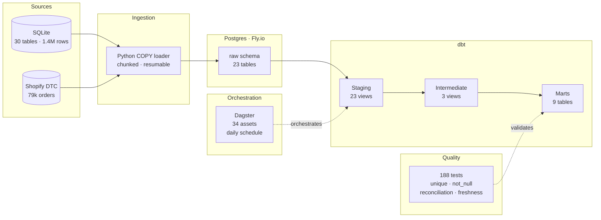

# Cinderhaven Data Platform

[](https://github.com/MsShawnP/cinderhaven-data-platform/actions/workflows/ci.yml)
[](https://msshawnp.github.io/cinderhaven-data-platform/)

Modern data platform for a fictional $25M specialty food brand.
Postgres + dbt + Dagster pipeline covering 23 source tables, 35
transformation models, and 188 data quality tests. Built to
demonstrate that the practice can ship real data infrastructure,
not analytical scripts on bundled files.

## Architecture



## What's in the warehouse

| Layer | Count | Materialization | Purpose |
|-------|-------|-----------------|---------|
| Raw | 23 tables | table | Faithful copy of source data |
| Staging | 23 models | view | Type casting, cleaning, null handling |
| Intermediate | 3 models | view | Crosswalks, entity resolution, payment joins |
| Marts | 9 models | table | Dimensions + facts + channel contribution |

**Dimensions:** `dim_products` (GTIN hierarchy, margins),
`dim_retailers` (store counts, channel type),
`dim_deduction_reasons` (dispute rules, evidence requirements)

**Facts:** `fct_orders` (B2B + DTC unified), `fct_shipments`
(compliance flags), `fct_deductions` (dispute outcomes, net loss),
`fct_chargebacks`, `fct_payments` (deduction summaries),
`mart_channel_contribution` (layered profitability by channel)

## Data quality

188 dbt tests validate the pipeline:

- **Unique keys** on every primary key
- **Not-null** on required business columns
- **Accepted values** on enumerated fields
- **Referential integrity** between facts and dimensions
- **Row-count bounds** on key tables (dbt_expectations)
- **Cross-layer reconciliation** — revenue and deduction totals
  verified from staging through marts
- **Source freshness** — warn/error thresholds on 8 transactional
  tables

## Repo structure

```
cinderhaven-data-platform/
  cinderhaven/              # dbt project
    models/
      staging/              # 23 staging views + schema.yml
      intermediate/         # 3 crosswalk/resolution views
      marts/                # 3 dims + 5 facts (tables)
    dbt_project.yml
  orchestration/            # Dagster project
    cinderhaven_orchestration/
      assets.py             # dbt → Dagster asset integration
      definitions.py        # jobs, schedules, resources
      project.py            # path configuration
    pyproject.toml
  scripts/
    reload.py                      # Full pipeline reload (ingest + dbt build)
    ingest_sqlite_to_postgres.py   # COPY-based bulk loader
    generate_shopify_orders.py     # DTC data generation
  sql/
    raw_schema.sql          # 23 CREATE TABLE statements
  docs/
    architecture.md         # Architecture diagram + pipeline flow
    walkthrough.md          # Design decisions walkthrough
    data-gap-assessment.md  # Source data audit
    dbt-docs/               # Generated dbt docs site
```

## Stack

| Component | Tool | Version |
|-----------|------|---------|
| Warehouse | Postgres on Fly.io | 16 |
| Transformation | dbt-core + dbt-postgres | 1.11 |
| Orchestration | Dagster + dagster-dbt | 1.13 |
| Ingestion | Python (psycopg2 COPY) | 3.13 |

## Reloading data

When the source data changes, reload the full pipeline:

```bash
# Prerequisites:
# 1. flyctl proxy running:  flyctl proxy 5432 -a cinderhaven-db
# 2. For large tables, scale Fly.io to 1GB:
#    flyctl machine update <id> --memory 1024 -a cinderhaven-db

python scripts/reload.py

# After reload, scale back to 256MB:
# flyctl machine update <id> --memory 256 -a cinderhaven-db
```

The script runs three steps in sequence: SQLite → Postgres ingestion,
dbt package install, and `dbt build` (models + all tests). If any
step fails, it stops immediately with the exit code.

## Documentation

- **[Architecture](docs/architecture.md)** — pipeline diagram and
  layer descriptions
- **[Walkthrough](docs/walkthrough.md)** — source contracts, staging
  conventions, crosswalk design, test philosophy, orchestration
- **[Data gap assessment](docs/data-gap-assessment.md)** — what
  existed vs. what was generated
- **[dbt docs](docs/dbt-docs/index.html)** — model lineage, column
  descriptions, test coverage (open locally or via GitHub Pages)
