# Cinderhaven Data Platform — Architecture

```mermaid
graph LR
    subgraph Sources
        A1[("cinderhaven-data<br/>(SQLite · 21 tables)")]
        A2[("Shopify DTC<br/>(generated · 2 tables)")]
    end

    subgraph Ingestion
        B["Python COPY loader<br/>scripts/ingest_sqlite_to_postgres.py"]
    end

    subgraph "Postgres on Fly.io"
        direction TB
        subgraph raw["raw schema · 23 tables"]
            C1["product_master · retailers<br/>sku_costs · stores"]
            C2["orders · order_lines<br/>shipments · pack_records"]
            C3["deductions · remittances<br/>chargebacks · disputes"]
            C4["shopify_orders<br/>shopify_order_lines"]
        end
    end

    subgraph "dbt transformation"
        direction TB
        D["Staging<br/>23 views · type casting + cleaning"]
        E["Intermediate<br/>3 views · crosswalks + entity resolution"]
        F["Marts<br/>8 tables · dimensions + facts"]
    end

    subgraph Marts["Mart tables"]
        F1["dim_products<br/>dim_retailers<br/>dim_deduction_reasons"]
        F2["fct_orders · fct_shipments<br/>fct_deductions · fct_chargebacks<br/>fct_payments"]
    end

    subgraph Orchestration
        G["Dagster<br/>34 assets · daily schedule"]
    end

    subgraph Quality
        H["dbt tests<br/>132 assertions"]
    end

    A1 --> B
    A2 --> B
    B --> raw
    raw --> D
    D --> E
    E --> F
    F --> F1
    F --> F2
    G -. "orchestrates" .-> D
    H -. "validates" .-> F

    style Sources fill:#1a1a2e,stroke:#e94560,color:#fff
    style raw fill:#16213e,stroke:#0f3460,color:#fff
    style Marts fill:#0f3460,stroke:#e94560,color:#fff
```

## Pipeline flow

1. **Sources** — SQLite database (21 tables, 1.1M+ rows) from the
   cinderhaven-data repo, plus generated Shopify DTC orders (10k orders,
   19k line items).

2. **Ingestion** — Python script using Postgres COPY with chunked
   reconnection (25k rows per chunk). Supports `--resume` for partial
   failure recovery.

3. **Raw schema** — 23 tables in Postgres `raw` schema on Fly.io.
   Faithful copy of source data, no transformations.

4. **Staging** — 23 dbt views. Type casting, column renaming, null
   handling. One model per source table.

5. **Intermediate** — 3 dbt views. Deduction code crosswalk, product-
   retailer resolution (unpivoted pricing + margins), retailer payment
   joins with dispute flags.

6. **Marts** — 8 dbt tables. 3 dimensions (products, retailers,
   deduction reasons) and 5 facts (orders, shipments, deductions,
   chargebacks, payments). `fct_orders` unifies B2B and DTC channels.

7. **Quality** — 132 dbt tests. Unique keys, not-null constraints,
   accepted values, referential integrity between facts and dimensions.

8. **Orchestration** — Dagster loads all dbt models as assets with full
   dependency graph. Daily refresh schedule at 6 AM UTC.
